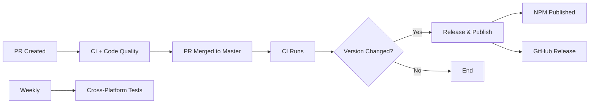

# GitHub Actions Workflows

This directory contains GitHub Actions workflows for automated testing, quality checks, and releases.

## 🔧 Workflows Overview

### 1. `ci.yml` - Continuous Integration
- **Triggers**: Pull requests and pushes to `master`
- **Node versions**: 18.x, 20.x
- **Features**:
  - Installs dependencies with `npm ci`
  - Runs test suite with coverage
  - Uploads test results and coverage reports
  - Integrates with Codecov for coverage tracking

### 2. `cross-platform.yml` - Cross-Platform Testing
- **Triggers**: Weekly schedule (Mondays at 2:00 UTC), manual dispatch
- **Platforms**: Ubuntu, Windows, macOS
- **Node versions**: 18.x, 20.x
- **Features**:
  - Tests package across different operating systems
  - Ensures compatibility across platforms
  - Can be triggered manually for testing

### 3. `code-quality.yml` - Code Quality Checks
- **Triggers**: Pull requests to `master`
- **Features**:
  - TypeScript compilation checks
  - Test execution with coverage
  - PR commenting with coverage reports
  - Codecov integration

### 4. `release.yml` - Automated Release and Publishing
- **Triggers**: Pushes to `master` (when version changes), manual dispatch
- **Features**:
  - Automatic version change detection
  - NPM publishing with provenance
  - GitHub release creation
  - Git tag creation
  - Build artifacts attachment

## 🚀 Workflow Flow



## 📋 Required Setup

### NPM Publishing
For automatic NPM publishing, configure the following secret:

1. **Repository Settings** → **Secrets and variables** → **Actions**
2. **Add secret**:
   - **Name**: `NPM_TOKEN`
   - **Value**: Your NPM access token

#### Generate NPM Token:
```bash
npm login
npm token create --access public
```

### Codecov (Optional)
For enhanced coverage reporting:
1. Sign up at [codecov.io](https://codecov.io)
2. Connect your repository
3. Add `CODECOV_TOKEN` secret (if private repo)

## 🔄 Release Process

### Automated Release Steps:
1. **Version Detection**: Checks if `package.json` version changed
2. **Quality Gates**: Runs tests and builds
3. **NPM Publishing**: Publishes to npm registry with provenance
4. **GitHub Release**: Creates release with changelog and artifacts
5. **Tagging**: Creates Git tag (e.g., `v1.2.3`)

### Manual Release:
```bash
# Update version
npm version patch  # or minor/major

# Push to trigger release
git push origin master

# GitHub Actions handles the rest!
```

## 🛠️ Customization

### Modify Test Coverage Thresholds:
Edit `package.json`:
```json
{
  "jest": {
    "coverageThreshold": {
      "global": {
        "branches": 75,
        "functions": 80,
        "lines": 80,
        "statements": 80
      }
    }
  }
}
```

### Change Release Schedule:
Modify `cross-platform.yml`:
```yaml
on:
  schedule:
    - cron: '0 2 * * 1'  # Every Monday at 2:00 UTC
```

### Add Additional Platforms:
Update matrix in `cross-platform.yml`:
```yaml
strategy:
  matrix:
    os: [ubuntu-latest, windows-latest, macos-latest]
    node-version: [18.x, 20.x]
```

## 📊 Monitoring

- **Actions Tab**: View all workflow runs and their status
- **Codecov Dashboard**: Monitor test coverage trends
- **NPM Package**: Track download statistics and versions

## 🐛 Troubleshooting

### Common Issues:

1. **Tests Failing**: Check test logs in Actions tab
2. **Coverage Too Low**: Review coverage reports and add missing tests
3. **Release Not Triggered**: Ensure version in `package.json` actually changed
4. **NPM Publish Fails**: Verify `NPM_TOKEN` is configured correctly

### Debug Commands:
```bash
# Run tests locally
npm test

# Check package contents
npm pack --dry-run

# Validate package.json
npm pkg get version
```