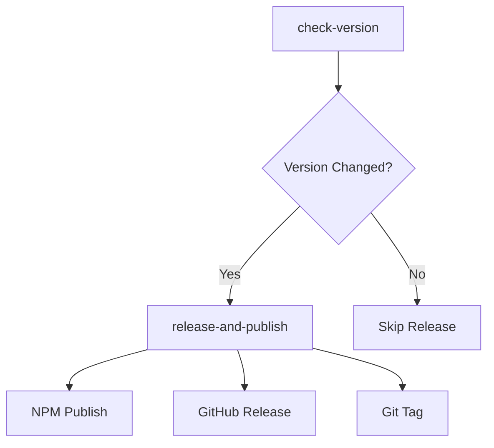

# Release and Publishing Workflow

This document explains the automated release and publishing system for the axios-har-tracker package.

## 📦 Overview

The release workflow automatically handles:
- ✅ Version change detection
- ✅ Quality gates (tests, builds)
- ✅ NPM package publishing
- ✅ GitHub release creation
- ✅ Git tag management

## 🔧 Workflow: `release.yml`

### Triggers
- **Push to master**: When `package.json` version changes
- **Manual dispatch**: Can be triggered manually from Actions tab

### Jobs Structure



#### 1. `check-version`
- Compares current vs previous version in `package.json`
- Outputs version change status and version numbers
- Uses Git history to detect changes

#### 2. `release-and-publish` 
- **Conditions**: Only runs if version changed
- **Steps**:
  1. Install dependencies
  2. Run test suite
  3. Build package
  4. Publish to NPM
  5. Create Git tag
  6. Create GitHub Release

## ⚙️ Configuration

### Required Secrets

| Secret | Purpose | How to Get |
|--------|---------|------------|
| `NPM_TOKEN` | NPM publishing | `npm token create --access public` |
| `GITHUB_TOKEN` | Release creation | Auto-provided by GitHub |

### Required Permissions
```yaml
permissions:
  contents: write    # Create releases and tags  
  id-token: write    # NPM provenance
```

### Setup Instructions

1. **Generate NPM Token**:
   ```bash
   npm login
   npm token create --access public
   ```

2. **Add to GitHub Secrets**:
   - Go to **Settings** → **Secrets and variables** → **Actions**
   - Click **New repository secret**
   - Name: `NPM_TOKEN`
   - Value: Your generated token

## 🚀 Release Process

### Automatic Release Workflow

1. **Developer Updates Version**:
   ```bash
   npm version patch  # 1.0.0 → 1.0.1
   # or
   npm version minor  # 1.0.1 → 1.1.0
   # or  
   npm version major  # 1.1.0 → 2.0.0
   ```

2. **Push to Master**:
   ```bash
   git push origin master
   ```

3. **GitHub Actions**:
   - ✅ Detects version change
   - ✅ Runs tests and builds
   - ✅ Publishes to NPM
   - ✅ Creates GitHub Release
   - ✅ Tags commit with version

### Manual Release

You can also trigger releases manually:

1. Go to **Actions** tab
2. Select **Release and Publish** workflow  
3. Click **Run workflow**
4. Choose branch and run

## 📋 Release Artifacts

Each release includes:

### NPM Package
- Published to: `https://www.npmjs.com/package/axios-har-tracker`
- With provenance for security
- Public access

### GitHub Release
- **Tag**: `v{version}` (e.g., `v1.2.3`)
- **Artifacts**: 
  - Source code (auto-generated)
  - Package tarball (`.tgz` file)
- **Release Notes**: Auto-generated with version info and changelog links

## 🔄 Version Management

### Semantic Versioning
The project follows [SemVer](https://semver.org/):

- **Patch** (`1.0.0` → `1.0.1`): Bug fixes
- **Minor** (`1.0.1` → `1.1.0`): New features (backward compatible)
- **Major** (`1.1.0` → `2.0.0`): Breaking changes

### Version Commands
```bash
# Patch release (bug fixes)
npm version patch && git push origin master

# Minor release (new features)  
npm version minor && git push origin master

# Major release (breaking changes)
npm version major && git push origin master

# Pre-release versions
npm version prerelease --preid=beta && git push origin master
```

## 🐛 Troubleshooting

### Release Not Triggered

**Check**: Version actually changed
```bash
git log --oneline -5 -- package.json
git diff HEAD~1 package.json
```

**Solution**: Ensure version in `package.json` is different from previous commit

### NPM Publish Fails

**Common Causes**:
- Missing or invalid `NPM_TOKEN`
- Version already exists on NPM
- Package name conflicts

**Solutions**:
```bash
# Check token validity
npm whoami

# Check existing versions
npm view axios-har-tracker versions --json

# Test publish locally
npm publish --dry-run
```

### GitHub Release Fails

**Common Causes**:
- Tag already exists
- Insufficient permissions
- Invalid release notes

**Solutions**:
```bash
# Check existing tags
git tag -l

# Delete tag if needed (local and remote)
git tag -d v1.0.0
git push origin :refs/tags/v1.0.0
```

## 📊 Monitoring

### Success Indicators
- ✅ NPM package appears at: `https://www.npmjs.com/package/axios-har-tracker/v/{version}`
- ✅ GitHub release created: `https://github.com/{owner}/{repo}/releases/tag/v{version}`
- ✅ Git tag created: `git tag -l | grep v{version}`

### Workflow Summary
Each successful release creates a summary showing:
- NPM package URL
- GitHub release URL
- Version information

## 🔧 Customization

### Modify Release Notes
Edit the `body` section in `release.yml`:
```yaml
body: |
  ## 🚀 Release v${{ needs.check-version.outputs.new-version }}
  
  ### What's Changed
  - Your custom release notes here
```

### Change NPM Access
Modify publish command in `release.yml`:
```yaml
run: npm publish --access public  # or --access restricted
```

### Add Release Assets
Add files to include in release:
```yaml
files: |
  *.tgz
  dist/
  docs/
```

This workflow ensures reliable, automated releases while maintaining quality and providing full traceability! 🎯